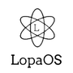

<!-- PROJECT SHIELDS -->
<!--
*** I'm using markdown "reference style" links for readability.
*** Reference links are enclosed in brackets [ ] instead of parentheses ( ).
*** See the bottom of this document for the declaration of the reference variables
*** for contributors-url, forks-url, etc. This is an optional, concise syntax you may use.
*** https://www.markdownguide.org/basic-syntax/#reference-style-links
-->
[![Contributors][contributors-shield]][contributors-url]
[![Forks][forks-shield]][forks-url]
[![Stargazers][stars-shield]][stars-url]
[![Issues][issues-shield]][issues-url]
[![MIT License][license-shield]][license-url]


####This project is here to be archived as my First Ever Project so dont judge the idea
<!-- PROJECT LOGO -->
<br />
<p align="center">
  <a href="https://github.com/Lopastudio/LopaOS">
    
  </a>

  <h3 align="center">LopaOS</h3>

  <p align="center">
    My "operating system" built with Python and maybe in c# in future.
    <br />
    <a href="https://github.com/Lopastudio/LopaOS/wiki/"><strong>Explore the docs »</strong></a>
    <br />
    <br />
    <a href="https://github.com/Lopastudio/LopaOS/issues">Report Bug</a>
    ·
    <a href="https://github.com/Lopastudio/LopaOS/issues">Request Feature</a>
  </p>
</p>


<!-- TABLE OF CONTENTS -->
<details open="open">
  <summary>Table of Contents</summary>
  <ol>
    <li>
      <a href="#about-the-project">About The Project</a>
      <ul>
        <li><a href="#built-with">Built With</a></li>
      </ul>
    </li>
    <li>
      <a href="#getting-started">Getting Started</a>
      <ul>
        <li><a href="#prerequisites">Prerequisites</a></li>
        <li><a href="#installation">Installation</a></li>
      </ul>
    </li>
    <li><a href="#usage">Usage</a></li>
    <li><a href="#license">License</a></li>
    <li><a href="#contact">Contact</a></li>
  </ol>
</details>


<!-- ABOUT THE PROJECT -->
## About The Project

[![Product Name Screen Shot][product-screenshot]](https://lopastudio.sk/LopaOS)

This project started as a project to test my skills and if I am going to be able to make a "operating system".

### Built With

This project is mainly built in Python 3, but I am planing to port it to diffrent languages. I can port it to C# and make from it a full operating system using Cosmos Framework. If I really wanted I could use Alpine Linux to boot Python and ran LopaOS as a basic fake "operating system". But using Cosmos I could make a TRUE operating system, because you have to write Kernel and all of the libraries. Cosmos uses SysLinux Bootloader so we can call it a Operating System.
* [Python](https://python.org/)
* [Cosmos](https://www.gocosmos.org/)
* [Alpine Linux](https://www.alpinelinux.org/)


<!-- GETTING STARTED -->
## Getting Started

To run LopaOS on your computer, you dont have to be by any means a profesional developer. Just install python, download the latest release and BAM. You are good to go. 

### Prerequisites

First you need to install Python which is used to, well run the code, because Python is a interpretted language so you need a runtime enviroment to run it. 
* Debian
  ```sh
  sudo apt install python3-pip -y
  ```

### Installation

1. Download the latest version from https://github.com/Lopastudio/LopaOS/releases/
2. Run the installation program which is contained in the Programs folder.
* Debian/Linux
  ```sh
   cd ./programs/
   python3 install.py
   ```
3. After you finish the installation / initialization you can run the "operating system" using os.py application contained in the programs directory
   ```sh
   cd ./programs/
   python3 os.py
   ```


<!-- USAGE EXAMPLES -->
## Usage

All of the commands are documented in the [Documentation](https://github.com/Lopastudio/LopaOS/wiki/).


<!-- CONTACT -->
## Contact

Patrik - [@Lopatka#9897](https://discord.com) - info@lopastudio.sk


<!-- MARKDOWN LINKS & IMAGES -->
<!-- https://www.markdownguide.org/basic-syntax/#reference-style-links -->
[contributors-shield]: https://img.shields.io/github/contributors/Lopastudio/LopaOS.svg?style=for-the-badge
[contributors-url]: https://github.com/Lopastudio/LopaOS/graphs/contributors
[forks-shield]: https://img.shields.io/github/forks/Lopastudio/LopaOS.svg?style=for-the-badge
[forks-url]: https://github.com/Lopastudio/LopaOS/network/members
[stars-shield]: https://img.shields.io/github/stars/Lopastudio/LopaOS.svg?style=for-the-badge
[stars-url]: https://github.com/Lopastudio/LopaOS/stargazers
[issues-shield]: https://img.shields.io/github/issues/Lopastudio/LopaOS.svg?style=for-the-badge
[issues-url]: https://github.com/Lopastudio/LopaOS/issues
[license-shield]: https://img.shields.io/github/license/Lopastudio/LopaOS.svg?style=for-the-badge
[license-url]: https://github.com/Lopastudio/LopaOS/blob/master/LICENSE.txt
[linkedin-shield]: https://img.shields.io/badge/-LinkedIn-black.svg?style=for-the-badge&logo=linkedin&colorB=555
[linkedin-url]: https://linkedin.com/in/othneildrew
[product-screenshot]: images/screenshot.png
